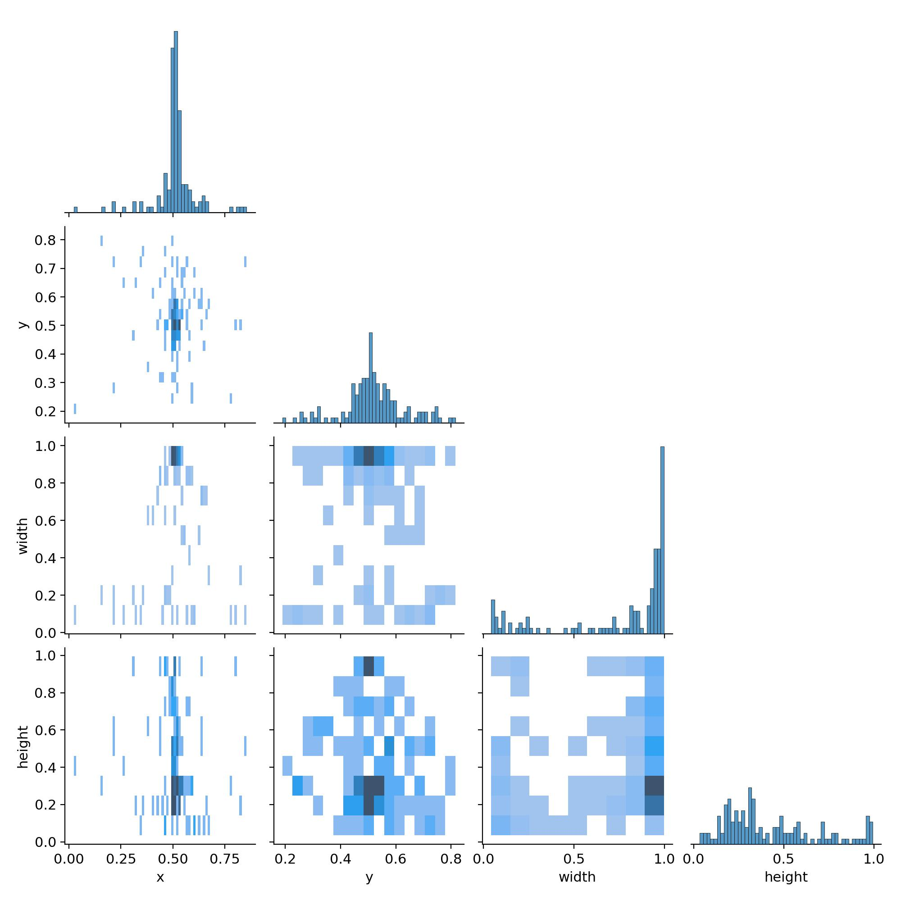
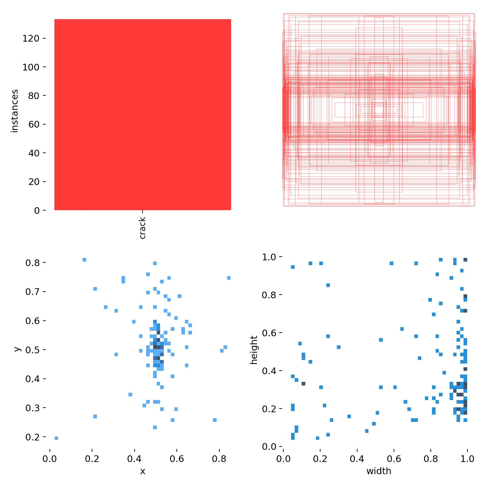
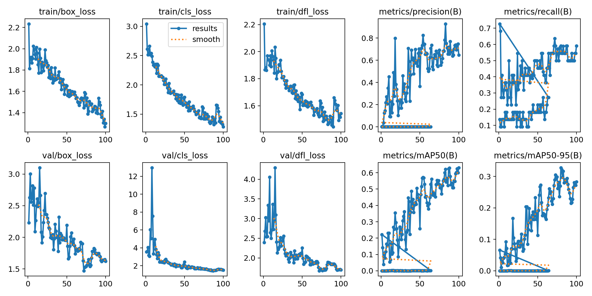
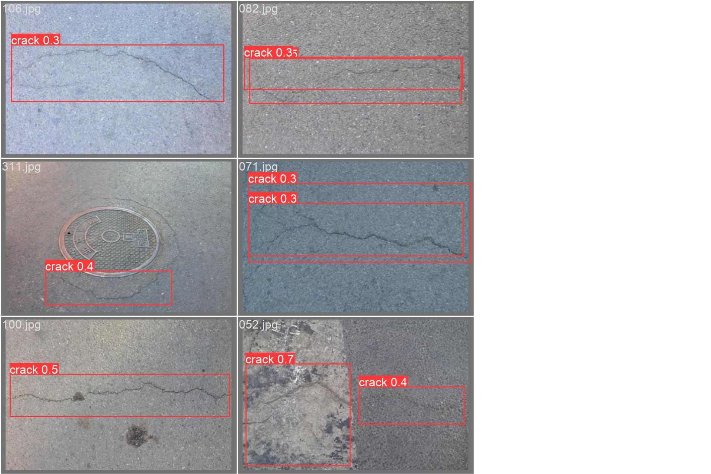

# 基于yolov8的基建裂缝目标检测系统

### 安装环境
```bash
    python -m venv venv # 创建虚拟环境
    venv/Scripts/activate # 进入虚拟环境
    pip install -r requirements.txt # 安装依赖
```
**注意：pytorch cuda的格式可能不一致，注意辨别。选用适合自己的cuda版本进行安装**

### 文件目录

> crack/ 裂缝检测输出文件
  datasets/ 数据集
  detects/ 推理集
  slime/ 史莱姆检测失败案例（数据集不够）
  crack_predict.py 推理detects/crack下的所有图片的裂缝
  crack_train.py 训练crack数据集
  get_path.py 取出一些数据当作评估数据，在训练完毕后会进行评估
  voc_to_yolo 将voc格式转换为yolo需要的labels格式
  slime_*.py (一些史莱姆的失败案例)
  yolov8n.pt 包含了模型的结构和训练好的参数的训练模型

### 使用
`python crack_predict.py` 检测`detects/crack/*`中图片的裂缝，并输出到`crack/crack_predict/`下,输出文件包含，被标记的图片以及labels
`python crack_train.py` 训练基建裂缝数据集，并输出训练集到`crack/crack_train/`并且生成评估信息

### 修改yolov8源码方面
修改在 yolov8 的源码 `ultralytics/ultralytics/cfg` 目录下 default.yaml ，并将 amp 改为 False


### 一些指标









### 数据标注
采用labelimg进行标注，后使用voc_to_yolo转换标注格式，然后通过get_path()，随机分配评估数据集与训练数据集


### 声明
数据来源于工业场景表面缺陷检测数据集及论文集(https://github.com/Charmve/Surface-Defect-Detection)。